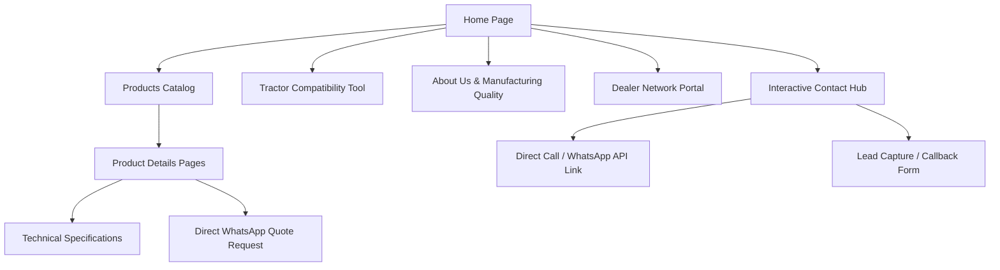

# Product Requirements Document (PRD)
## Project: Premium Industrial Web Platform for Madina Engineering Works

---

## 1. Executive Summary & Client Overview

### 1.1 Business Profile
* **Company Name:** Madina Engineering Works
* **Established:** 2008 (18+ Years of Manufacturing Excellence)
* **Headquarters/Factory Location:** Mehandwas, Tonk, Rajasthan, India
* **Industry Sector:** Heavy Agricultural Machinery Manufacturing & Engineering Attachments
* **Primary Products:** Tractor-Mounted Hydraulic Loaders (Single/Double Ram, Heavy-Duty, Sugarcane Grabbers, Dozer Attachments, Bumper Attachments, Custom Hydraulic Attachments)
* **Market Presence:** Initially regional (Rajasthan), expanding nationwide across India.

### 1.2 Strategic Objectives
1. **Brand Uplift:** Establish Madina Engineering Works as a premium, nationally recognized industrial manufacturer rather than a local workshop.
2. **Lead Generation:** Optimize the conversion funnel to maximize incoming phone calls and WhatsApp inquiries from mobile devices.
3. **Product Showcase:** Professionally catalog heavy machinery products with specifications, high-definition visual assets, and application-specific capabilities.
4. **Dealer Network Expansion:** Build a dedicated entry point for agricultural and construction equipment dealers to apply for dealerships.
5. **Trust and Validation:** Highlight 18+ years of expertise, manufacturing capacity, structural testing, and client reviews to reassure distant buyers.

### 1.3 Target Audience Breakdown

| Target Segment | Core Needs / Pain Points | Conversion Drivers |
| :--- | :--- | :--- |
| **Farmers & Tractor Owners** | Need reliable, long-lasting loaders to handle heavy farm tasks (silage, manure, fodder, grain bag handling). Budget-conscious but values durability. | Video proof, clear compatibility with their tractor model, simple warranty terms, direct WhatsApp call. |
| **Contractors & Brick Kilns** | High-cycle daily usage. Require minimal downtime and maximum lift height (up to 14 ft) for loading high-sided trucks/kilns. | Reinforced chassis specs, structural steel grades, high cylinder capacity, 2-ton load certification, fast service response. |
| **Warehouse & Industrial Owners** | Material handling in tight spaces. Safety and precision of controls are critical. | Lift capacity certifications, turning radius alignment, smooth valve control feedback, customized attachments (forks, buckets). |
| **Dealers & Distributors** | Looking for a reliable manufacturing partner with consistent supply, reasonable margins, and marketing support. | Transparent wholesale capabilities, custom manufacturing capacity, geographic exclusivity options, quick query response. |

---

## 2. Mobile-First UX/UI Architecture (Highest Priority)

Since **over 95% of target visitors** will access the website via mobile devices (primarily mid-range and budget Android smartphones on fluctuating mobile networks), the platform's user experience must be designed mobile-first.

```
+---------------------------------------------------+
|               Sticky Header                       |
|  [Logo]                             [Call Now]    |
+---------------------------------------------------+
|                                                   |
|                Hero Section                       |
|    - Bold Engineering Title                       |
|    - 2-Ton Capacity & 14 Ft Lift Height Badge     |
|    - Play Video Demo                              |
|                                                   |
|  +---------------------------------------------+  |
|  |     Tractor Compatibility Matcher (Widget)  |  |
|  |  1. Select Brand: [ Swaraj            ]      |  |
|  |  2. HP Category:  [ 50 HP - 60 HP     ]      |  |
|  |  [ FIND COMPATIBLE LOADER ]                 |  |
|  +---------------------------------------------+  |
|                                                   |
+---------------------------------------------------+
|             Scroll-Revealed Content               |
|                                                   |
+---------------------------------------------------+
|           Sticky Bottom Action Dock               |
|  [Call Now (Tap)]  |  [WhatsApp Inquiry (Tap)]     |
+---------------------------------------------------+
```

### 2.1 Mobile Touch Targets & Sizing
* **Minimum Interactive Target Size:** `48px x 48px` with at least `8px` of separation to prevent mis-clicks.
* **Primary Navigation:** Simplified mobile header with a prominent "Tap to Call" phone icon, plus a sliding drawer menu containing structured pages.
* **One-Handed Thumb Zone Mapping:** Placing critical actions (Call, WhatsApp, Specs Configurator) in the bottom third of the screen.
* **Form Inputs:** Input heights set to a minimum of `52px` with absolute labels that transition upwards to prevent layout shifts. Font size inside fields must be at least `16px` to prevent iOS zoom-on-focus issues.

### 2.2 Device & Network Optimization
* **Low-End Hardware Compatibility:** Eliminate heavy WebGL overlays or deep nested JavaScript processing. Animations must rely strictly on hardware-accelerated CSS properties (`transform: translate3d/scale`, `opacity`) instead of layout properties (`height`, `width`, `margin`).
* **Slow Connection Resilience:** 
  * The site must be functional within **1.5 seconds** on a slow 3G connection.
  * Essential text assets must render using system font fallbacks before custom typography is downloaded (`font-display: swap`).
  * CSS must be inline-critical or compiled in a single minified bundle (<30KB).
  * JavaScript logic must be written in lightweight vanilla JavaScript or optimized frameworks with zero external dependency bloat.

---

## 3. Brand Identity & Design System

The visual identity must command respect and reflect heavy-duty mechanical engineering. The website design should mirror the heavy, rugged steel construction of Madina loaders.

### 3.1 Color Palette
The color palette represents safety, raw iron/steel strength, high energy, and industrial precision.

```
       #EBB815           #12151A           #22272E           #E05315           #FFFFFF
┌──────────────────┐┌──────────────────┐┌──────────────────┐┌──────────────────┐┌──────────────────┐
│  Industrial Gold ││  Deep Charcoal  ││  Iron/Steel Grey ││  Safety Orange   ││   Signal White   │
│  Accent / Accent ││  Dark Background││  Midtones/Cards  ││  Alerts/Buttons  ││   Readable Text  │
│  HSL(45, 85%, 50%)││ HSL(215, 18%, 9%)││HSL(215, 15%, 16%)││ HSL(18, 82%, 48%)││ HSL(0, 0%, 100%) │
└──────────────────┘└──────────────────┘└──────────────────┘└──────────────────┘└──────────────────┘
```

* **Primary Background:** `#12151A` (Deep Charcoal) - Creates a modern, high-tech industrial feel.
* **Secondary Surface Card:** `#22272E` (Iron/Steel Grey) - Holds specifications, products, and reviews.
* **Primary Accent Color:** `#EBB815` (Industrial Gold Yellow) - Reflects warning/safety markings and yellow hydraulic machinery arms.
* **Secondary Action Call-to-Action:** `#E05315` (Safety Orange) - High-visibility call-out buttons.
* **Base Text Color:** `#FFFFFF` (Signal White) and `#9EA6B0` (Cool Grey) - Optimizes reading contrast against dark backdrops.

### 3.3 Typography

* **Headings Font:** `Outfit` (Google Fonts) - Clean, geometric, and bold. Gives a modern industrial look.
  * *H1 Styles:* `font-weight: 800; text-transform: uppercase; letter-spacing: -0.02em;`
  * *H2 Styles:* `font-weight: 700; text-transform: uppercase; letter-spacing: -0.01em;`
* **Body Typography:** `Inter` (Google Fonts) - Extremely legible on small screens.
  * *Body Styles:* `font-weight: 400; line-height: 1.6; letter-spacing: 0.01em;`
  * *Technical Data Sheets:* `font-family: ui-monospace, SFMono-Regular, Menlo, Monaco, Consolas, monospace;` to highlight numbers and values clearly.

### 3.3 Spacing, Grid, and Card Layouts
* **Base Unit:** `8px` grid system. Padding/margins defined in multiples of 8 (`8px`, `16px`, `24px`, `32px`, `48px`, `64px`).
* **Grid Layouts:**
  * *Mobile:* 1-column layout for details, 2-column layout for compact specs comparison.
  * *Desktop:* 12-column grid. Left-aligned typography, asymmetrical media layouts to resemble industrial drafting templates.
* **Card Design:** Semi-flat with subtle industrial micro-borders:
  * `border: 1px solid rgba(235, 184, 21, 0.15);` (Subtle Gold tint)
  * `background: linear-gradient(135deg, #1C2127 0%, #15191E 100%);`
  * No heavy box-shadows. Use thin golden borders or scale transformations on hover to indicate interactivity.

---

## 4. Information Architecture & Website Structure

The structure must facilitate fast discovery, answer compatibility questions immediately, and guide users to call or message via WhatsApp.



### 4.1 Global Pages & Features Blueprint

#### 1. Home Page (Core Landing Runway)
* **Purpose:** Immediately establish industry leadership, highlight capability metrics, and direct users to key product catalogs.
* **Layout Structure:**
  1. **Hero Header:** Background loop (highly optimized silent video or sequence of premium loader action photos). Main headline: `"ENGINEERED TO OUTPERFORM. BUILT TO LAST."` Subhead: `"18+ Years of Manufacturing India's Heavy-Duty Tractor Mounted Hydraulic Loaders & Agricultural Attachments."`
  2. **Key Metric Badges:** Three large industrial tiles:
     * **14 Feet** Max Lift Height (for high-sided trucks & brick kilns).
     * **2 Tons** Tested Lift Capacity.
     * **18+ Years** Manufacturing Legacy.
  3. **Interactive Tractor Compatibility Finder:** Dropdowns for tractor brand and horsepower that display the correct loader model.
  4. **Key Products Highlights:** Premium cards of the primary loader models.
  5. **Industrial Durability Section:** Bullet list detailing structural reinforcement, heavy-duty double-lip piston seals, and solid steel bushings.
  6. **Social Proof & Customer Reviews:** Real photos from clients at site locations in Rajasthan, Haryana, Madhya Pradesh, etc.
  7. **Direct Action Form:** Simple quick callback form.

#### 2. About Us & Manufacturing Excellence
* **Purpose:** Showcase that Madina is a state-of-the-art facility, building trust with buyers who cannot visit Mehandwas in person.
* **Key Content:**
  * **Interactive Timeline:** Scroll-triggered trace of Madina's growth from a single workshop in 2008 to a highly trusted fabrication house.
  * **Manufacturing Quality Standards:** Highlighting CO2 welding bays, precision lathe machines, hydraulic test chambers, anti-corrosion chemical primer washes, and double-coat industrial enamel paint finishes.
  * **Founder/Management Message:** Reaffirming the commitment to supporting Indian farmers and industrial contractors.

#### 3. Products & Attachments Catalog
* **Purpose:** Index the entire catalog, separated into clear categories.
* **Categories:**
  * **Heavy-Duty Hydraulic Loaders** (Tractor mounted, front-end)
  * **Agricultural Specialized Attachments** (Sugarcane Grabbers, Silage Grabs, Cotton Grabbers)
  * **Industrial & Construction Attachments** (Debris Buckets, Dozer Blades, Forklift Attachments)
  * **Tractor Safety Accessories** (Heavy Bumper Assemblies, Cabin Over-head Guards)
* **Functional Feature:** Filtering tabs to switch between applications (e.g., Brick Kiln, Construction, Farm Loading, Industrial Warehouses) without page refreshes.

#### 4. Product Details Template
* **Purpose:** Convert product page views into active leads.
* **Layout Elements:**
  * **HD Media Gallery:** Zoomable product images showing multiple angles (chassis frame, hydraulic cylinder connection, tractor side brackets).
  * **Tractor Compatibility Checklist:** Table showing compatible brands (Swaraj, John Deere, Mahindra, Massey Ferguson, Sonalika, New Holland) and minimum HP requirements.
  * **Interactive Specifications Table:**
    
    | Technical Parameter | Heavy Duty Loader (14 Ft) | Standard Loader (12 Ft) | Sugarcane Grabber Special |
    | :--- | :--- | :--- | :--- |
    | **Max Lift Height** | 14 Feet | 12 Feet | 13.5 Feet |
    | **Lift Capacity** | 2000 kg (2.0 Tons) | 1500 kg (1.5 Tons) | 1800 kg |
    | **Hydraulic Ram Type** | Double-Acting Double Ram | Double-Acting Double Ram | Heavy Duty Triple Ram System |
    | **Sheet Steel Thickness**| 8 mm / 10 mm reinforced | 6 mm / 8 mm | 8 mm / 10 mm |
    | **Mounting Time** | ~3 Hours (Pin-On/Off) | ~3 Hours (Pin-On/Off) | ~4 Hours |

  * **Download Spec Sheet Button:** Sticky download option for detailed brochures (packaged as compressed, fast-loading PDF files).
  * **"Get Quote for Swaraj 744 / Massey 241" Button:** Form automatically populated with the product name.

#### 5. Custom Manufacturing & Design
* **Purpose:** Address buyers with specialized requirements (e.g., extra-wide buckets, customized lift arms, heavy material handling configurations).
* **Process Flow Explanation:** A clean 4-step diagram showing CAD Modeling -> Raw Steel Sourcing & Cutting -> Assembly & Hydraulic Testing -> Final Delivery.
* **Lead Capture Form:** Option to upload tractor photographs and specifications for custom estimates.

#### 6. Dealer Network Portal
* **Purpose:** Attract and sign up machinery dealers across new Indian states.
* **Key Features:**
  * **Benefits Sheet:** Highlights high-demand territories, robust warranty support, marketing brochures, and wholesale pricing.
  * **Dealer Application Form:** Structured collection fields including Firm Name, GSTIN (optional), Location (District & State), and Available Tractor Space.

#### 7. Media Gallery & Video Demonstrations
* **Purpose:** Prove structural capability through real operational videos.
* **Layout:** Grid of YouTube embeds or lightweight, autoplaying looping silent video shorts showing loaders lifting heavy brick batches, handling sugarcane piles, and digging gravel.

#### 8. Warranty, Service & Support Center
* **Purpose:** Address post-purchase anxieties.
* **Key Information:**
  * **Warranty Outline:** Coverage details on hydraulic cylinder seals, distributor block valves, and structural loader arms.
  * **Spare Parts Ordering Guide:** Direct links to request replacement hydraulic hoses, pins, seals, and control valves.
  * **Maintenance Schedules:** Video guides showing where to grease bushings and check hydraulic oil levels to prevent wear.

#### 9. Interactive Contact Hub
* **Purpose:** Eliminate friction in connecting with sales representatives.
* **Features:**
  * **Interactive Maps Integration:** Pinpointing the primary manufacturing plant in Mehandwas, Tonk, Rajasthan.
  * **Multi-Channel Contact Links:** Quick action icons to Call, WhatsApp, Email, or Request a callback.

---

## 5. Technical Architecture & Implementation Specifications

To guarantee fast loading on mobile devices and simple maintenance, the website should be built using modern web development standards.

### 5.1 Technology Stack & Directory Structure
* **Frontend Core:** Semantic HTML5, Vanilla JavaScript (ES6+), and CSS3 with custom variables.
* **Build tool:** Vite for compiling, asset bundling, and dev serving.
* **Build output:** Fully static assets optimized for caching and delivery via Content Delivery Networks (CDN).
* **Package Management:** NPM with a clean, dependency-free `package.json`.

```
/LOADAR
├── index.html                  # Main entry point (highly optimized structure)
├── package.json                # Project build commands & development dependencies
├── vite.config.js              # Vite optimization rules (asset minification)
├── assets/                     # Media & asset directories
│   ├── images/                 # Compressed WebP/AVIF product images
│   ├── icons/                  # Inline SVG icons
│   └── videos/                 # Highly compressed looping hero videos
├── css/                        # Modular styles
│   └── index.css               # Unified design token system & global styling rules
└── js/                         # JavaScript source files
    ├── main.js                 # Global navigation & animation initialization
    ├── compatibility.js        # Tractor compatibility calculator logic
    └── contact.js              # Form validation & WhatsApp API payload handlers
```

### 5.2 Performance Budgets & Metrics
* **Total JavaScript Bundle Size:** < 45 KB (Gzipped/Minified).
* **Total CSS Payload:** < 20 KB.
* **Performance Targets (Mobile Profile):**
  * **First Contentful Paint (FCP):** < 1.0 seconds.
  * **Largest Contentful Paint (LCP):** < 2.2 seconds.
  * **Cumulative Layout Shift (CLS):** < 0.05.
  * **Total Blocking Time (TBT):** < 150 milliseconds.
* **Hosting:** Cloudflare Pages or Vercel Edge Server to ensure low latency inside India.

### 5.3 Image & Asset Processing Pipeline
* All raw raster images (PNG, JPG) must be converted into **WebP** and **AVIF** formats.
* Implement responsive image tags (`<picture>`) to serve smaller image sizes to mobile devices:
  ```html
  <picture>
    <source srcset="assets/images/loader-main-mobile.avif" type="image/avif" media="(max-width: 600px)">
    <source srcset="assets/images/loader-main-mobile.webp" type="image/webp" media="(max-width: 600px)">
    <source srcset="assets/images/loader-main-desktop.avif" type="image/avif" media="(min-width: 601px)">
    
  </picture>
  ```
* Every image must include strict `width` and `height` attributes to prevent Cumulative Layout Shifts during loading.

---

## 6. Interactive Features & Animation Specifications

Animations must feel fluid, premium, and mechanical. Avoid distracting or floaty visual effects.

### 6.1 Interactive Widget Specifications

#### 1. Tractor Compatibility Matcher
* **Logic Flow:**
  1. The user selects their **Tractor Manufacturer** from a dropdown list (e.g., Swaraj, Mahindra, John Deere, Massey Ferguson, Sonalika, Farmtrac, Powertrac, Escorts, Eicher, New Holland).
  2. The user selects the **Horsepower Range** of their tractor model (e.g., 30 - 40 HP, 41 - 50 HP, 51 - 60 HP, Above 60 HP).
  3. The system runs local JavaScript comparison logic (no server requests required) and returns:
     * Recommended Loader Attachment Model.
     * Compatible bracket types.
     * Maximum safe lifting height and capacity recommendations.
     * An instant **"Enquire for [Selected Tractor Model]"** button that generates a pre-formatted WhatsApp text payload.
* **Data Matrix Table:**
  
  | HP Category | Recommended Loader | Max Safe Load | Recommended Frame Reinforcement |
  | :--- | :--- | :--- | :--- |
  | **30 - 40 HP** | Light Duty / Dozer Blade Attachments | 1.0 Ton | Basic Bracket Support |
  | **41 - 50 HP** | Standard Loader (12 Ft Lift Height) | 1.5 Tons | Full Chassis Tie Bar |
  | **51 - 60 HP** | Heavy Duty Loader (14 Ft Lift Height) | 2.0 Tons | Extended Side Support Arms |
  | **Above 60 HP** | Heavy Duty Max Loader / Sugarcane Grabber | 2.2 Tons | Extended Side Support & Rear Linkage Tie |

#### 2. Mobile Floating Quick-Action Bar
* A sticky bottom bar positioned at the bottom of the mobile screen.
* Remains visible only when the user scrolls past the Hero Section.
* Contains two high-contrast actions:
  * **[Call Now (Left Button - Safety Orange Background)]** -> Triggers a direct mobile telephone call link.
  * **[WhatsApp Quote (Right Button - WhatsApp Green Background)]** -> Launches the WhatsApp application with a pre-configured quote request payload.

### 6.2 Animation Design Guidelines

All animations must use hardware-accelerated CSS properties to ensure smooth transitions on mobile devices.

```css
/* Optimized CSS transition parameters */
.card-hover-effect {
  will-change: transform, border-color;
  transition: transform 0.3s cubic-bezier(0.16, 1, 0.3, 1), border-color 0.3s ease;
}

.card-hover-effect:hover {
  transform: translateY(-6px);
  border-color: #EBB815;
}
```

* **Scroll Reveal Animations:** Sections must slide up smoothly (`15px`) and fade in as they enter the browser viewport. Use simple, lightweight JavaScript `IntersectionObserver` loops rather than heavy external libraries.
* **Loading Skeleton Placeholders:** Standard gray-and-gold pulsing gradients should appear while loading specification cards, preventing layout shifting.
* **FAQ Accordion Animations:** Use CSS `grid-template-rows` transitions or simple `max-height` transitions with a `cubic-bezier` speed curve to create smooth expansion animations.

---

## 7. Conversion Optimization (CRO) & Lead Funnel

The website's design is focused on conversion. The primary goal is to turn mobile web traffic into direct, high-value inquiries.

```
                  Web Traffic (Mobile & Desktop)
                               │
                               ▼
        ┌──────────────────────────────────────────────┐
        │  Hero Section Video Loop & Metric Badges     │
        └──────────────────────┬───────────────────────┘
                               │
                               ▼
        ┌──────────────────────────────────────────────┐
        │  Tractor Compatibility Matcher Widget        │
        └──────────────────────┬───────────────────────┘
                               │
                               ├───────────────────────┐
                               ▼                       ▼
                    [ Quick Phone Call ]      [ WhatsApp API Chat ]
                               ▲                       ▲
                               │                       │
        ┌──────────────────────┴───────────────────────┴─┐
        │  Sticky Bottom Quick-Action Dock (Always On)  │
        └───────────────────────────────────────────────┘
```

### 7.1 Lead Capture Mechanisms
1. **Interactive Form Fields:** Simple forms with 3 to 4 input fields maximum to minimize user input fatigue:
   * Full Name
   * Mobile Phone Number (validated for 10-digit formats)
   * Tractor Brand & Model (pre-filled if using the calculator widget)
   * Preferred Delivery Location (City, State)
2. **Dynamic WhatsApp URL Payloads:** Pre-formatted message templates that make it easy for users to send inquiries:
   * *Example:* `https://wa.me/91XXXXXXXXXX?text=Hi%20Madina%20Engineering,%20I%20am%20interested%20in%20a%2014%20Ft%20Heavy%20Duty%20Loader%20for%20my%20Swaraj%20855%20Tractor.%20My%20location%20is%20Tonk.%20Please%20send%20pricing%20details.`

---

## 8. SEO, Structured Data, & Accessibility (a11y)

### 8.1 On-Page SEO Architecture
* **Title Tag Structure:** `[Product Name] - Tractor Mounted Hydraulic Loader | Madina Engineering Works`
* **Meta Descriptions:** Direct, action-oriented, and keyword-rich templates:
  > *"Get premium, heavy-duty tractor-mounted hydraulic loaders (1.5 to 2.2 Ton capacity, up to 14 Ft lift height) from Madina Engineering Works. 18+ years of manufacturing reliability. Custom builds, nationwide delivery."*
* **Heading Tags (h1-h6):** A single `<h1>` on the home page, with secondary sub-sections organized using clean `<h2>` and `<h3>` tags.
* **Local SEO Optimization:** Embed the Google Map location coordinates for the Mehandwas factory, along with full address details, telephone lines, and operating hours in the website footer.

### 8.2 JSON-LD Schema Integrations

Inject the following schema templates directly into the HTML header:

```json
{
  "@context": "https://schema.org",
  "@type": "LocalBusiness",
  "name": "Madina Engineering Works",
  "image": "https://madinaloaders.com/assets/images/logo.png",
  "telephone": "+91-9928509899",
  "email": "info@madinaloaders.com",
  "address": {
    "@type": "PostalAddress",
    "streetAddress": "National Highway 52, Mehandwas",
    "addressLocality": "Tonk",
    "addressRegion": "Rajasthan",
    "postalCode": "304021",
    "addressCountry": "IN"
  },
  "geo": {
    "@type": "GeoCoordinates",
    "latitude": 26.2625,
    "longitude": 75.8361
  },
  "url": "https://madinaloaders.com",
  "priceRange": "₹₹₹",
  "openingHoursSpecification": {
    "@type": "OpeningHoursSpecification",
    "dayOfWeek": [
      "Monday",
      "Tuesday",
      "Wednesday",
      "Thursday",
      "Friday",
      "Saturday"
    ],
    "opens": "09:00",
    "closes": "18:00"
  }
}
```

```json
{
  "@context": "https://schema.org",
  "@type": "Product",
  "name": "Madina Tractor Mounted Heavy-Duty Hydraulic Loader",
  "image": "https://madinaloaders.com/assets/images/heavy-duty-loader.webp",
  "description": "Premium 14 Ft lift height, 2.0 Ton capacity tractor-mounted front-end hydraulic loader designed for agricultural and construction operations.",
  "brand": {
    "@type": "Brand",
    "name": "Madina Engineering Works"
  },
  "offers": {
    "@type": "AggregateOffer",
    "priceCurrency": "INR",
    "lowPrice": "150000",
    "highPrice": "350000",
    "offerCount": "10"
  }
}
```

### 8.3 Accessibility Rules (WCAG 2.1 AA Checklist)
* **Contrast Ratios:** Text must maintain a minimum contrast ratio of `4.5:1` against dark backgrounds to remain readable under sunlight.
* **Alternative Text:** Every image tag must have descriptive alt text detailing the machine type and tractor model shown.
* **Screen Reader Labels:** Form inputs must use explicit labels, and icon buttons must include `aria-label` tags (e.g., `aria-label="Call Customer Care"`).
* **Keyboard Accessibility:** All interactive elements must show a high-visibility yellow outline focus indicator (`outline: 2px solid #EBB815; outline-offset: 2px;`) during keyboard navigation.

---

## 9. Launch & System Integration Checklist

Prior to final production deployment, the development system must verify the following items:

- [ ] **Asset Minification:** Verify all CSS and JavaScript bundles are minified, with empty source map declarations removed.
- [ ] **Cross-Device Testing:** Run rendering audits on Chrome, Safari, Firefox, and Samsung Internet (particularly on simulated low-end mobile devices).
- [ ] **WhatsApp Payload Validation:** Test all dynamic links to ensure WhatsApp text queries are encoded and display the correct contact numbers.
- [ ] **Contact Form Endpoints:** Test the database integration or email relay API for form submissions to ensure leads are captured successfully.
- [ ] **SEO Validation:** Verify structural tag hierarchies, image alt tags, and JSON-LD schema blocks using structured data tools.
- [ ] **PageSpeed Performance Audit:** Verify mobile audit scores are above **90 points** for Performance, Accessibility, Best Practices, and SEO.
